### Learning to Perceive: Scene Understanding for Autonomous Driving

*EU H2020 Marie Skłodowska‑Curie Actions Innovative Training Network ACHIEVE ([MSCA-ITN-ACHIEVE](http://www2.imse-cnm.csic.es/achieve-itn/)) grant agreement No. 765866*

PhD Thesis at Institute of Systems and Robotics, University of Coimbra, Portugal

Scene understanding is the most fundamental module in the perception system of an autonomous vehicle, as it provides a contextual understanding of the scene, which is required for safe planning and control of the autonomous vehicle. In this thesis, we proposed novel algorithms for scene understanding tasks such as 3D object detection based on LiDAR and multi-modal data, 3D semantic segmentation, and a panoptic driving perception system for autonomous driving.

Publications during PhD research work can be found <a href="https://gopi-erabati.github.io/publications/">here</a>

Thesis Overview

| 3D Object Detection (LiDAR) | 3D Semantic Segmentation (LiDAR) |
| :---: | :---: |
| [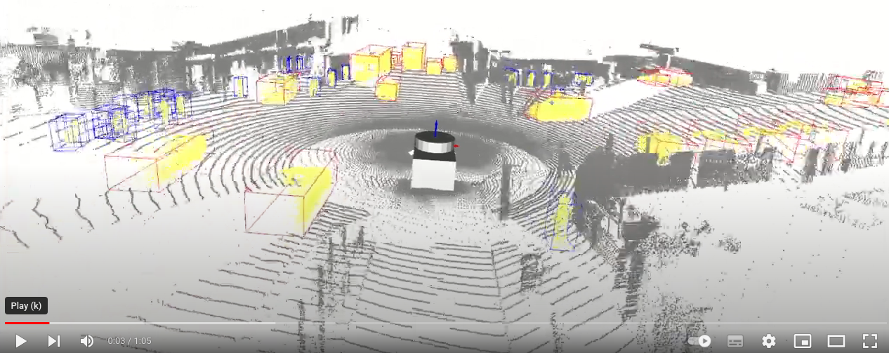](https://youtu.be/cbnHHVaWsuc)| [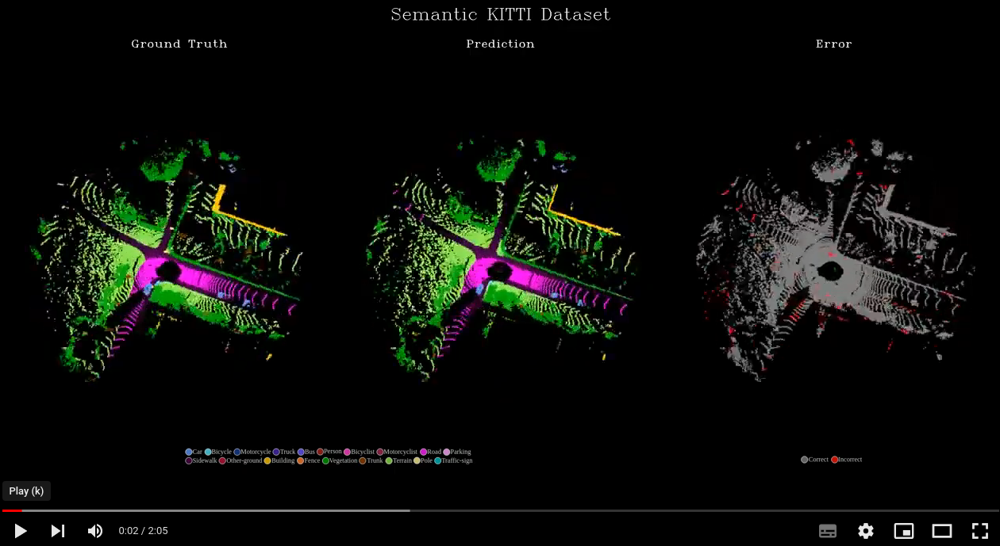](https://youtu.be/Yr6Wu0nHeeE)|

| 3D Object Detection (LiDAR + Camera) | Moving Object Segmentation |
| :---: | :---: |
| [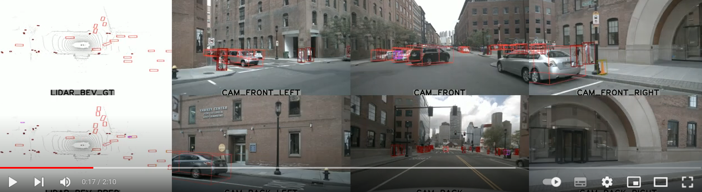](https://youtu.be/TFJhpJ6JjMQ)| [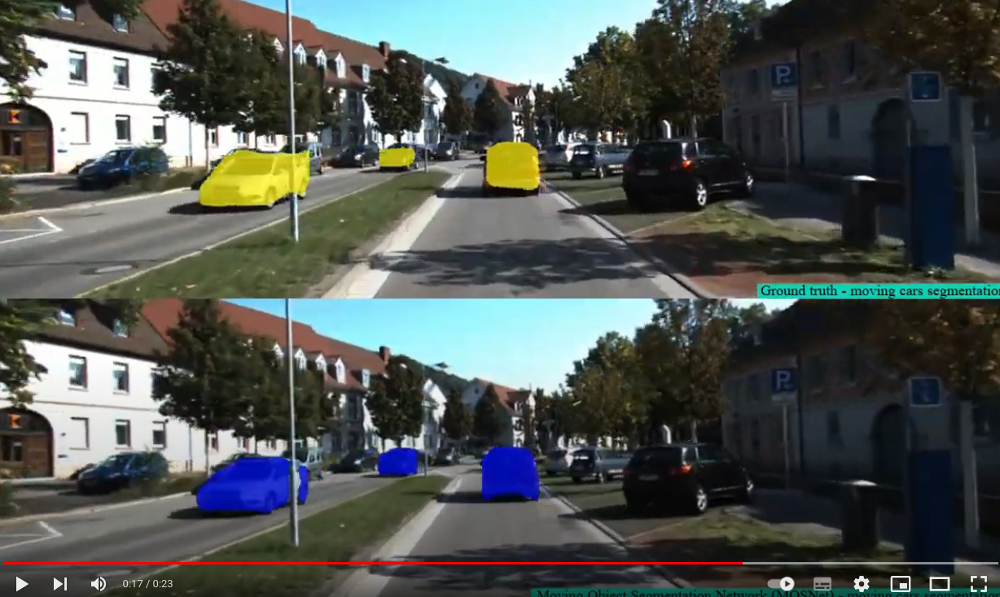](https://youtu.be/4eYi80o8MQI)|

**********

### 3D Object Detection and Relative Localization using a 3D Sensor Embedded on a Mobile Robot

[Code](https://github.com/gopi-erabati/Object-Pose-Estimation) [Master Thesis](https://github.com/gopi-erabati/Object-Pose-Estimation/blob/master/GopikrishnaErabati-thesis.pdf) at LAAS-CNRS, Toulouse, France

This thesis tries to solve the issue of object pose estimation using 3D data of scene acquired from 3D sensors (e.g., Kinect, Orbec Astra Pro among others). 3D data has an advantage of independence from object texture and invariance to illumination. The proposal is divided into two phases: An offline phase where the 3D model template of the object (for estimation of pose) is built using Iterative Closest Point (ICP) algorithm. And an online phase where the pose of the object is estimated by aligning the scene to the model using ICP, provided with an initial alignment using 3D descriptors (like Fast Point Feature Transform (FPFH)). The approach we develop is to be integrated on two different platforms: 1) Humanoid robot ‘Pyrene’ which has Orbec Astra Pro 3D sensor for data acquisition, and 2) Unmanned Aerial Vehicle (UAV) which has Intel RealSense Euclid on it. The datasets of objects (like electric drill, brick, a small cylinder, cake box) are acquired using Microsoft Kinect, Orbec Astra Pro and Intel RealSense Euclid sensors to test the performance of this technique. The objects used to test this approach are the ones used by robots. This technique is tested in two scenarios, firstly, when the object is on the table and secondly when the object is held in hand by a person. The range of objects from the sensor is 0.6 to 1.6m. This technique could handle occlusions of the object by hand (when we hold the object), as ICP can work even if partial object is visible in the scene.

| Single object pose estimation | Multiple objects pose estimation |
| :---: | :---: |
| [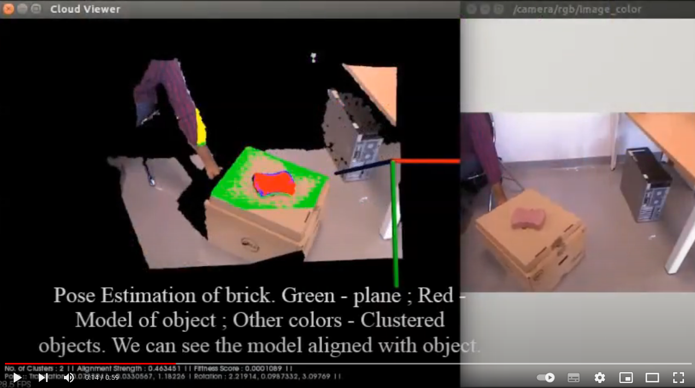](https://www.youtube.com/watch?v=8NoalZesWR0) | [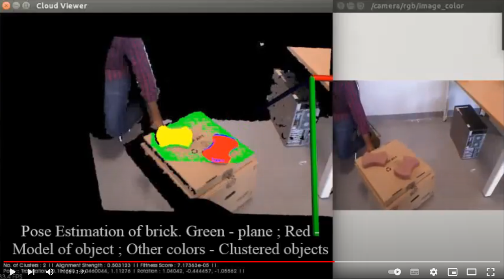](https://www.youtube.com/watch?v=cyvhGSBhMF0) |

***********

### Human Activity Recognition in Video

[Code](https://github.com/gopi-erabati/Human-Activity-Recognition-from-Videos-Using-Machine-Learning) [Report](https://github.com/gopi-erabati/Human-Activity-Recognition-from-Videos-Using-Machine-Learning/blob/master/report_HumanActivityDetction_SSI_GopikrishnaErabati_MohitKumarAhuja.pdf)

Actions can be characterized by spatiotemporal patterns. Like object detection, action detection finds the recurrences of such spatiotemporal patterns through pattern matching. I worked on a few types of interest-point based feature extractions like Spatio-Temporal Interest Point (STIP), 3D SIFT and Histogram of Oriented Optical Flow (HOOF) features. With the use of SVM classifier, I classified the actions. I implemented this human activity recognition on KTH dataset which has six actions like boxing, hand waving, hand clapping, jogging, running, and walking of 100 videos each.

[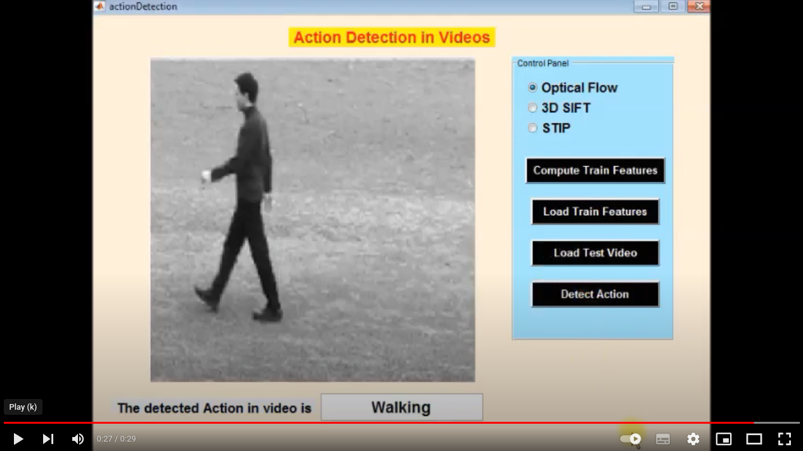](https://www.youtube.com/watch?v=Cn639T80BhQ)

**********
### Mapping, Autonomous Navigation and Localization of TurtleBot using ROS

[Code](https://github.com/gopi-erabati/Mapping_LocalizationOfARMarkers_Navigation_ROS_Turtlebot) [Report](https://github.com/gopi-erabati/Mapping_LocalizationOfARMarkers_Navigation_ROS_Turtlebot/blob/master/report_mappingAndLocalization_ROS.pdf)

The motto of the project is to gain experience in the implementation of different robotic algorithms using ROS framework. 
1. The first step of the task is to build a map of the environment and navigate to a desired location on the map.
2. Next, we must sense the location of marker (e.g., AR marker, color markers etc.) in the map, where there is pick and place task, and autonomously localize and navigate to the desired marker location.
3. After reaching the desired marker location, we have to precisely move towards the specified location based on visual servoing.
4. At the desired location, we have a robotic arm which picks up an object (e.g., a small cube) and places it on our TurtleBot (called the pick and place task).
5. After the pick and place task, again the robot needs to find another marker, which specifies the final target location, and autonomously localize and navigate to the desired marker location, which finishes the complete task of the project. 

Our team developed the software to implement the 1, 2 and 5 points in the above list. The implementation can be found in the attached project report.

[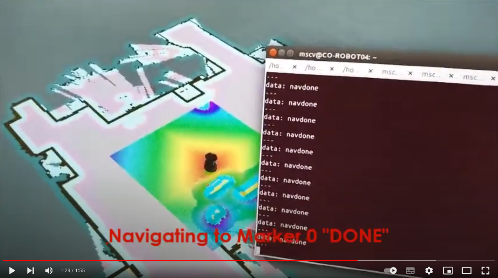](https://www.youtube.com/watch?v=YPKXm8cRIKs)

**********
### Development of 3D Human Body Scanner using Kinect and PCL

[Code](https://github.com/gopi-erabati/3D-Reconstruction-of-Human-using-Kinect-v2-and-PCL) [Report](https://github.com/gopi-erabati/3D-Reconstruction-of-Human-using-Kinect-v2-and-PCL)

The main objective of this project is to develop human 3D scanner software able to fully interface with a scanner rig composed of a turning table and a stationary depth sensor. The software is aimed to perform full body scan under 90 seconds. A friendly, interactive graphical user interface provides simple control and outputs watertight mesh results that can be used mainly but not limited to 3D printing. The project was implemented using Microsoft Kinect v2 and PCL library in a Windows OS.

| Registration using ICP with Normals | Noise Removal and Smoothing |
| :---: | :---: |
| 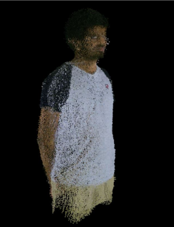 | 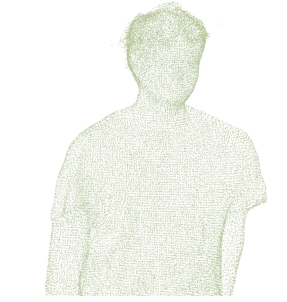 |

**********
### Development of Computer Vision Toolbox in C++ and MATLAB using OpenCV

[Code(C++)](https://github.com/gopi-erabati/Development-of-Image-Processing-and-Computer-Vision-Toolbox-using-C-and-OpenCV) [Report(C++)](https://github.com/gopi-erabati/Development-of-Image-Processing-and-Computer-Vision-Toolbox-using-C-and-OpenCV/blob/master/report_openCV_cPlusPlus_GoikrishnaErabati.pdf) [Code(MATLAB)](https://github.com/gopi-erabati/Development-of-Image-Processing-and-Computer-Vision-Toolbox-using-MATLAB) [Report(MATLAB)](https://github.com/gopi-erabati/Development-of-Image-Processing-and-Computer-Vision-Toolbox-using-MATLAB/blob/master/Report_CVToolBox_Matlab_GoikrishnaErabati.pdf)

In this project I aimed at developing CV tools like feature matching, camera calibration etc. not only using OpenCV and C++ but also with MATLAB.

| CV Toolbox GUI in C++ | CV Toolbox GUI in MATLAB |
| :---: | :---: |
| 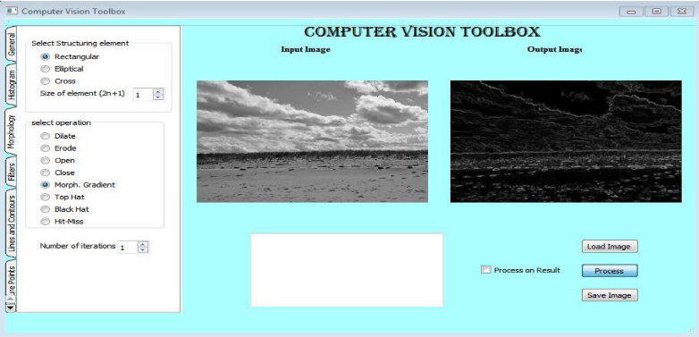 | 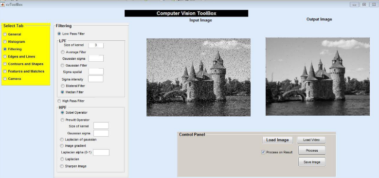 |

[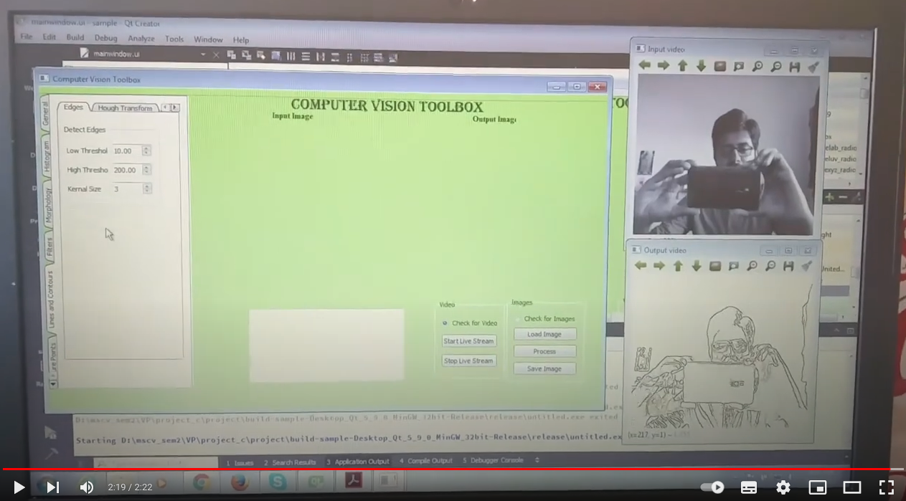](https://www.youtube.com/watch?v=9FG2c6Qe0XM)

**********
### Development of Face Recognition Software using PCA

[Code](https://github.com/gopi-erabati/Face-Recognition-Using-PCA) [Report](https://github.com/gopi-erabati/Face-Recognition-Using-PCA/blob/master/report_facerecog_PCA_ERABATI_DOUSAI.pdf)

The main objective of our project is to recognize faces from the collected set of face data using PCA (Principal Component Analysis). We have collected five pictures of every person, and the idea here is to extract a few features from the faces with the goal of reducing the number of variables used to represent the faces. In the next step, we divide the faces into two categories of train and test images. But the problem here is, an image has high dimensionality space (each image is a point in a space of dimension d = MN, M and N being image size) as each pixel is considered as a variable of an image. So, we can reduce the dimensionality by using PCA to simplify recognition problem, which can be considered as the core concept.

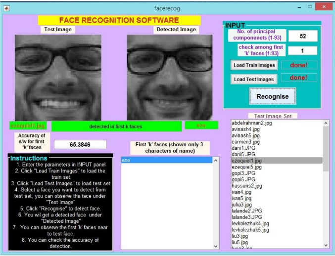

**********
### Bug0 Algorithm Implementation on E-Puck Robot

[Code](https://github.com/gopi-erabati/Bug0-Algorithm-Implementation-on-E-Puck-Robot) [Report](https://github.com/gopi-erabati/Bug0-Algorithm-Implementation-on-E-Puck-Robot/blob/master/report_bug0.pdf)

Bug 0 is a reactive-navigation algorithm that uses odometry. The robot starts with knowledge of the position of goal relative to its initial pose, but no knowledge of the environment. The strategy is then to use odometry to orient and move toward goal while reactively avoiding obstacles.

| Bug 0 simulation 1 | Bug 0 simulation 2 |
| :---: | :---: |
| [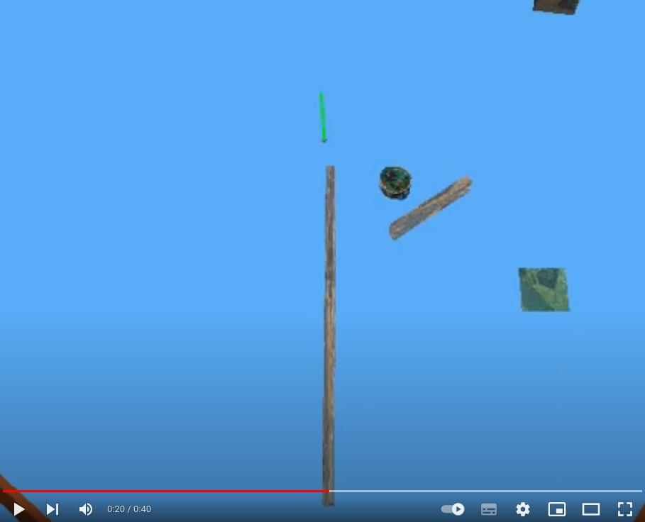](https://www.youtube.com/watch?v=-hTFp8UpcRo) | [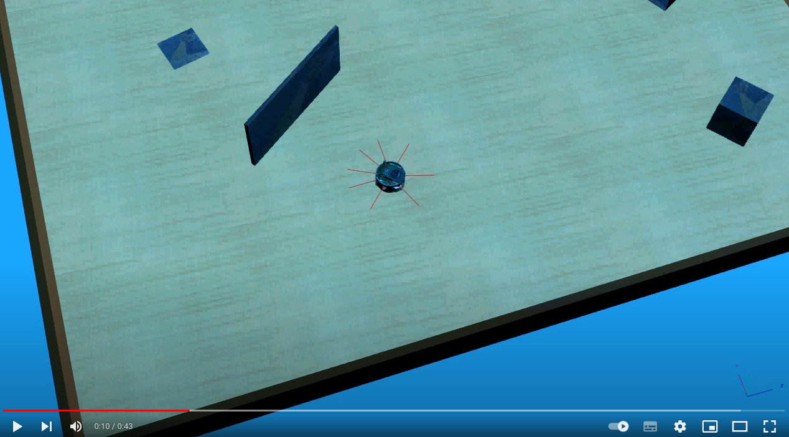](https://www.youtube.com/watch?v=R6BD9uD3BnU) |

**********
### Wall Follower E-Puck Robot

[Code](https://github.com/gopi-erabati/Wall-Follower-E-Puck-Robot) [Report](https://github.com/gopi-erabati/Wall-Follower-E-Puck-Robot/blob/master/Ghimire_Erabati_P0report.pdf)

Objectives in this project were: 1. Move the robot forward and stop at some distance from the wall and 2. Follow the encountered wall. Our approach was to build small behaviors like 'move forward', 'stop', etc. and organize them into a composite behavior that fulfilled the objectives. To make our robot follow a wall, we developed a 'follow wall' behavior based on PID control. We worked with a robot called e-puck, a differential-drive non-holonomic robot, to develop and deploy simple concepts in autonomous behavior-based robotics.

| Wall Follower (Simulation) | Wall Follower (Real-time) |
| :---: | :---: |
| [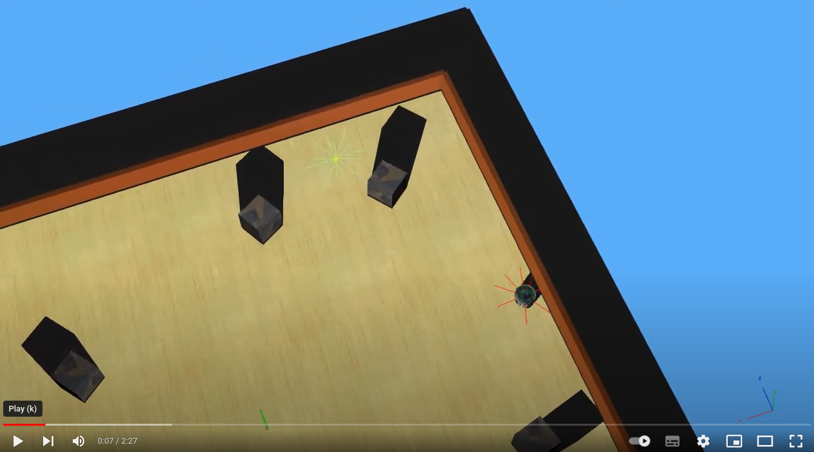](https://www.youtube.com/watch?v=gT462ntTajk) | [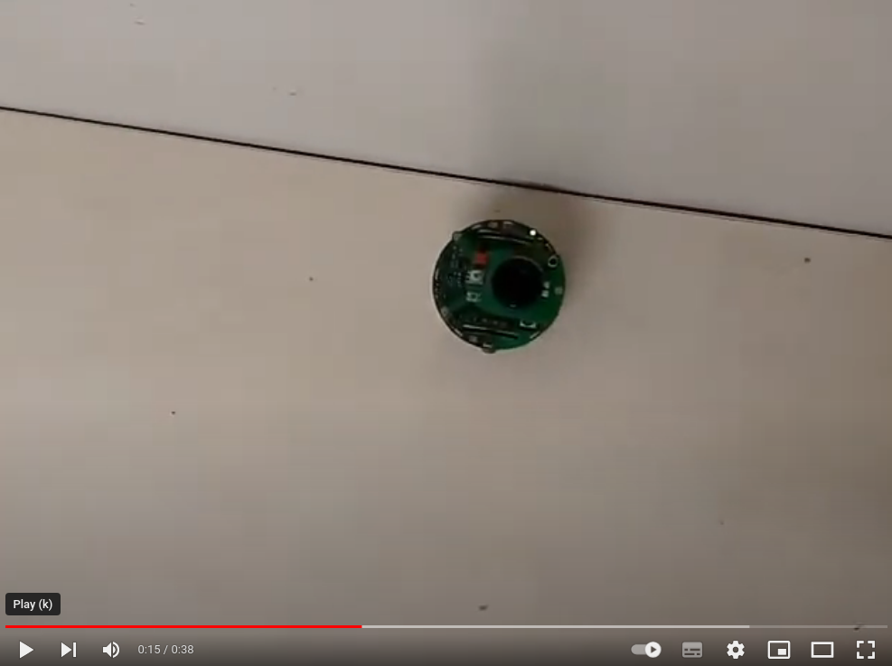](https://www.youtube.com/watch?v=0B48A3jn3qA) |

**********
### Forest Fire Mapping from Low Altitude Aerial Images

[Code](https://github.com/gopi-erabati/Forest-Fire-Mapping-from-low-altitude-aerial-images)

This project deals with the projection of forest fire segmented images onto the Digital Elevation Models (DEMs) using the Pinhole camera model. The project is developed in C++ using OpenCV and GDAL libraries. The inputs are: Digital Elevation Map (DEM) - raster model and Geo-referenced Images. The output is a fire map. This code concentrates on segmenting the geo-referenced images and updating the fire map by projecting the segmented images onto the DEM.

**********
### Classification using SVM

[Code](https://github.com/gopi-erabati/Classification-of-cats-and-dogs-using-SVM-classifier) [Report](https://github.com/gopi-erabati/Classification-of-cats-and-dogs-using-SVM-classifier/blob/master/report_hw2_GopikrishnaErabati.pdf)

The project aims to classify dogs and cats with the help of feature descriptor for representing the training data and training the SVM and application of cross-validation.

**********
### Build a Classifier to Filter Spam Emails

[Code](https://github.com/gopi-erabati/Build-a-classifier-to-filter-spam-emails) [Report](https://github.com/gopi-erabati/Build-a-classifier-to-filter-spam-emails/blob/master/report_hw2_GopikrishnaErabati.pdf)

The aim of this project is to build a classifier to filter spam emails. Before training a classifier, we can apply several preprocessing methods to this data such as standardize, transform or binarize data. For each preprocessing, a logistic regression model is fitted and compared with Naive Bayes classifier.

**********
### Projective Reconstruction

[Code](https://github.com/gopi231091/Projective-Reconstruction) [Report](https://github.com/gopi-erabati/Projective-Reconstruction/blob/master/report_GOPIKRISHNA-ERABATI.pdf)

This project aims to understand the pin-hole camera model and projective geometry. It deals with the computation of the fundamental matrix from camera parameters and the estimation of the fundamental matrix using two images. This project provides insight into epipolar geometry and stereovision.

**********
### Implementing Horn-Schunck and Lucas Kanade Optical Flow Methods

[Code](https://github.com/gopi-erabati/Implementing-Horn-Schunck-and-Lucas-Kanade-Optical-Flow-Methods) [Report](https://github.com/gopi-erabati/Implementing-Horn-Schunck-and-Lucas-Kanade-Optical-Flow-Methods/blob/master/report_GOPIKRISHNA-ERABATI.pdf)

The pattern of apparent motion of objects, surfaces, and edges in a visual scene that results from the relative motion between an observer and a scene is known as optical flow. It depends on the brightness constancy assumption. Horn and Schunck method is a global method to find optical flow. The main idea is to make the optical flow smooth. As the Optical Flow Constraint Equation (OFCE) is an under constrained equation that cannot be solved for each pixel, they proposed to add another smoothness term to OFCE. This method works for small motion. Lucas Kanade is a local method. The main idea is that the optical flow is constant near the current point (x, y). Each neighbor gives one equation. Here we assume that pixel's neighbor has same velocity (u, v). by taking pixels in a neighborhood, we get an over determined system which can be solved by Linear least squares or by pseudo inverse.

**********
### 2D Filtering using VHDL and FPGA

[Code](https://github.com/gopi-erabati/2D-Filtering-using-VHDL-and-FPGA) [Report](https://github.com/gopi-erabati/2D-Filtering-using-VHDL-and-FPGA/blob/master/report_2DFilterImple_GopikrishnaERABATI_AvinashNARAYANA.pdf)

The task is to implement a 2D filter to process the images using FPGA and VHDL (Very High-Speed Integrated Circuit Hardware Description Language). The image is 128 x 128 pixels in resolution and the kernel size is 33 pixels. The software used for the simulation and implementation is Xilinx ISE (Integrated Synthesis Environment) Design Suite and the language is VHDL.

**********
